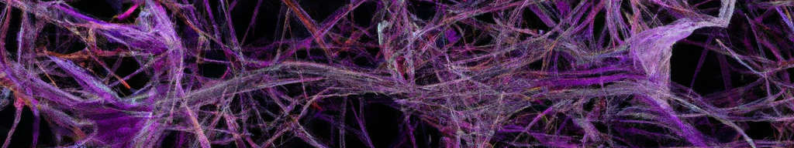
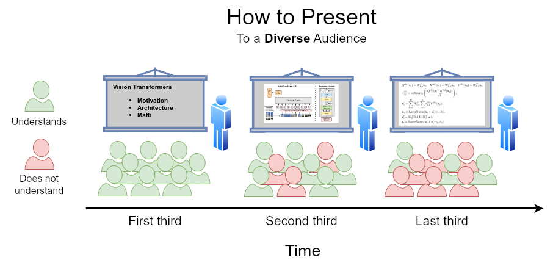
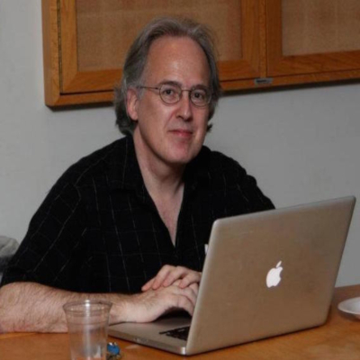
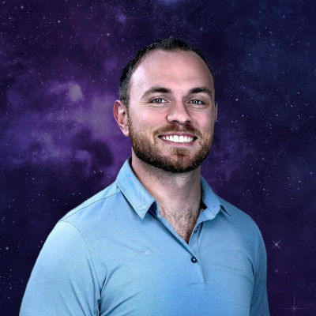
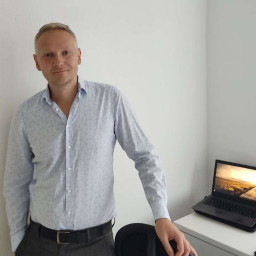
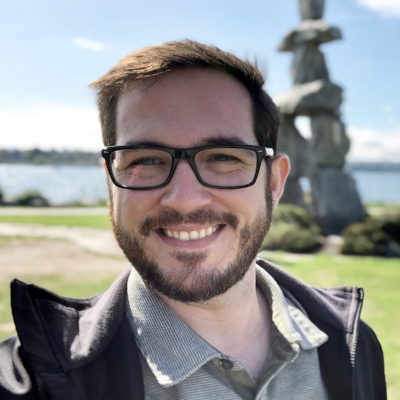

# FSU SC Machine Learning Seminar

We are a group of people located in and around Tallahassee, all sharing an interest in machine learning. Our primary objective is the exchange of knowledge and ideas. The seminar is hosted by the Department of Scientific Computing at the Florida State University (thus FSU SC). If you are interested in getting to know us and possibly joining, we convene every Friday at 1:00 pm ET at [SC-499](https://goo.gl/maps/BJLxE3Q7H1MTBqMu6) - you can also [join via zoom](https://fsu.zoom.us/j/9038137210). To become a part of our mailing list, please email [**Nathan Crock**](https://www.sc.fsu.edu/people?uid=ndc08). We are a diverse crowd, so presenting takes some thought. Our approach is best expressed by the NASA Trichotomy of Presenting, illustrated by Nathan: 

## Schedule for Fall 23

Fridays, 1:00 p.m. ET, [SC-499](https://goo.gl/maps/BJLxE3Q7H1MTBqMu6).  
Attend via Zoom: [Zoom Link](https://fsu.zoom.us/j/9038137210).  

| Date       | Topic        | Person | Materials/Links | 
|------------|--------------|--------|-----------------|
| 2023-09-15 | The Transformer Architecture | [Olmo Zavala Romero](https://www.sc.fsu.edu/people?uid=osz09) | [slides](materials/olmo_zavala/wk3_OZR_transformer.pdf), [video](https://www.youtube.com/watch?v=qqC3qCfrRx4&list=PL9tqMq5NvS1Nugw1sii6IKsB_8RJ9GqYj&index=3&pp=iAQB) |
| 2023-09-22 | Open Forum (new) | misc. | [video](https://www.youtube.com/watch?v=qoZg7Ihp-0g&list=PL9tqMq5NvS1Nugw1sii6IKsB_8RJ9GqYj&index=2&pp=iAQB) |
| 2023-09-29 | Vector databases (moved) | Tyler Foster | [slides+code+refs](materials/tyler_foster), [video](https://www.youtube.com/watch?v=bJbbYm4ixKk&list=PL9tqMq5NvS1Nugw1sii6IKsB_8RJ9GqYj&index=4&pp=iAQB) |
| 2023-10-06 | LLM Training Lifecycle | [Nathan Crock](https://www.sc.fsu.edu/people?uid=ndc08) | [slides+code](materials/nathan_crock),  [video](https://www.youtube.com/watch?v=1bO0jGnoCOA&list=PL9tqMq5NvS1Nugw1sii6IKsB_8RJ9GqYj&index=1&pp=iAQB) |
LLM Training Lifecycle.pdf	nb_for_seminar.ipynb |
| 2023-10-13 | Neural Operators | [Nick Dexter](https://www.sc.fsu.edu/people?uid=nd22f) | [slides+code](materials/nick_dexter), [video](https://www.youtube.com/watch?v=94IGMBhdEYQ&list=PL9tqMq5NvS1Nugw1sii6IKsB_8RJ9GqYj&index=5&pp=iAQB) |
| 2023-10-20 | Emergent Properties | [Tom Juzek](https://modlang.fsu.edu/person/tom-juzek) | tbd |
| 2023-10-27 | Neuro-biology and Neural Networks | Guest Speaker (tbd) | tbd |
| 2023-11-03 | Langchain | [Jose Miranda](https://www.sc.fsu.edu/people?uid=jrm22n) &   [Pankaj Chouhan](https://www.sc.fsu.edu/people?uid=pc19d) | tbd |
| 2023-11-10 | No meeting: Veterans Day | - | - |
| 2023-11-17 | Retentive Architecture | [Gordon Erlebacher](https://www.sc.fsu.edu/people/faculty?uid=gerlebacher) | tbd |
| 2023-11-24 | No meeting: Happy Thanksgiving ~ | - | - |
| 2023-12-01 | Reinforcement Learning (possibly RLHF) | [Tyler Foster](https://www.linkedin.com/in/tyler-foster-04a796b5) | tbd |
| 2023-12-08 | Formal Measures of Fairness: Beyond the Impossibility Theorem | [Zina Ward](https://philosophy.fsu.edu/person/zina-ward) | tbd |

## Current members and their ML interests

|            |            |            |            |
|------------|------------|------------|------------|
|    [**Gordon Erlebacher**](https://www.sc.fsu.edu/people/faculty?uid=gerlebacher)   FSU   Neuronal Populations   Evolving Topologies   LLMs |    [**Nathan Crock**](https://www.sc.fsu.edu/people?uid=ndc08)   FSU - Interdisciplinary Data Science   LLMs   Retrieval Augmented Generation   Computational Reading Models |    [**Tom Juzek**](https://modlang.fsu.edu/person/tom-juzek)   FSU   Morpho-syntax   NLP   LLMs |    [**Nick Dexter**](https://sites.google.com/view/ndexter)   FSU Scientific Comp.   Neural Operators   Interpretability   Explainable AI |

Send your details to [**Tom**](https://modlang.fsu.edu/person/tom-juzek) if you want to be added to the table. 

