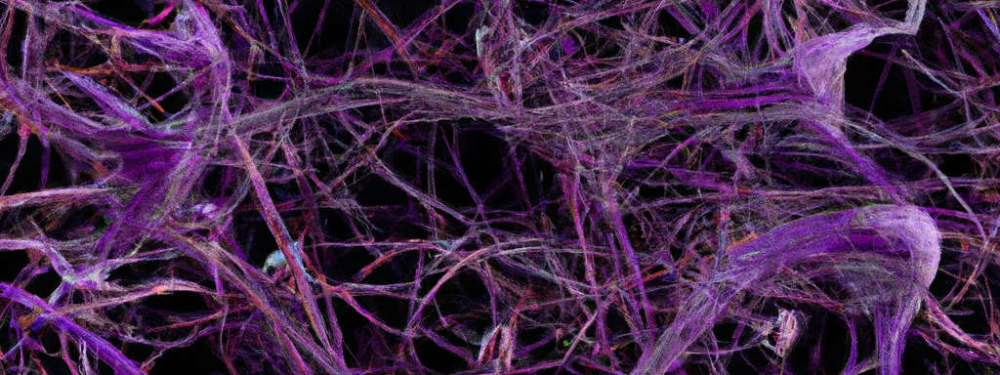

# University Machine Learning Group

We are a group of people located in and around Tallahassee, all sharing an interest in machine learning. Our primary objective is the exchange of knowledge and ideas. If you are interested in getting to know us and possibly joining, we convene every DAY-OF-THE-WEEK at LOCATION during the academic term. To become a part of our mailing list, please send an email to NAME/ADDRESS.

## Schedule for Fall 23

| Date       | Topic        | Person | Materials/Links |
|------------|--------------|--------|-----------------|
| Date 1     | Topic 1      | Person 1 | [Link 1](#) |
| Date 2     | Topic 2      | Person 2 | [Link 2](#) |
| Date 3     | Topic 3      | Person 3 | [Link 3](#) |

## Past Topics Included

You can find an overview of past topics [here](#). 

## Current Members and Their Interests

**Member Name 1**
- Interest 1, Interest 2, Interest 3

**Member Name 2**
- Interest 1, Interest 2, Interest 3

**Member Name 3**
- Interest 1, Interest 2, Interest 3
