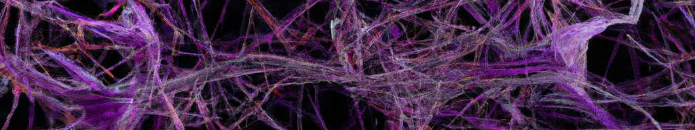
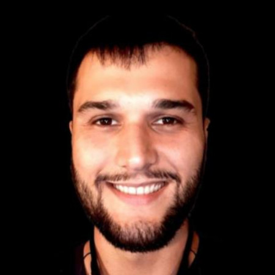

# FSU SC Machine Learning Seminar

We are a group of people located in and around Tallahassee, all sharing an interest in machine learning. Our primary objective is the exchange of knowledge and ideas. The seminar is hosted by the Department of Scientific Computing at the Florida State University (thus FSU SC). If you are interested in getting to know us and possibly joining, we convene every Friday at 1:00 pm ET at [SC-499](https://goo.gl/maps/BJLxE3Q7H1MTBqMu6) - you can also [join via zoom](https://fsu.zoom.us/j/9038137210). To become a part of our mailing list, please email [**Nathan Crock**](https://www.sc.fsu.edu/people?uid=ndc08). We are a diverse crowd, so presenting takes some thought. Our approach is best expressed by the NASA Trichotomy of Presenting, illustrated by Nathan: 

## Schedule for Spring 2024

Fridays, 12:00 p.m. ET, [SC-499](https://goo.gl/maps/BJLxE3Q7H1MTBqMu6).  
Attend via Zoom: [Zoom Link](https://fsu.zoom.us/j/9038137210).  

**Proposed topics to discuss**: 

- Phylogeny
- Multimodal
- Inductive Biases
- Embeddings
- State Models
- AI + data assimilation
- Sandy (All Sandy)
- Post transformer architecture
- Tutorials (classroom machines)
- Minimum working examples
- Education + ML
- Deep Fake
- Disinformation
- Optimization
- Training methods
- Spiking NN
- Automation of language evaluation
- State of open LLM.
- Language Frameworks
- Agents: Deep Dive
- Robotics
- Copyright (Law school)
- Quantum Computing ML
- Emotion
- Compression Techniques
- Health + ML
- inpainting
- Biases?
- Advanced RAG Retrievalo Augmented Generation
- Follow up Scientific Machine Learning
- Intro AGI

| Date       | Topic        | Person | Materials/Links | 
|------------|--------------|--------|-----------------|
| 2024-08-30 | Welcome session, outlook Spring 24 | misc. | - |
| 2024-09-06 |  - | - | - |
| 2024-09-13 |  - | - | - |
| 2024-09-20 |  - | - | - |
| 2024-09-27 |  - | - | - |
| 2024-10-04 |  - | - | - |
| 2024-10-11 |  - | - | - |
| 2024-10-18 |  - | - | - |
| 2024-10-25 |  - | - | - |
| 2024-11-01 |  - | - | - |
| 2024-11-08 |  - | - | - |
| 2024-11-15 |  - | - | - |
| 2024-11-22 |  - | - | - |
| 2024-11-29 | - | - | - |
| 2024-12-06 | - | - | - |
| 2024-12-13 | - | - | - |

## Current members and their ML interests

|            |            |            |            | 
|------------|------------|------------|------------|
|  |  |  |  |
| [**Gordon Erlebacher**](https://www.sc.fsu.edu/people/faculty?uid=gerlebacher) | [**Nathan Crock**](https://www.sc.fsu.edu/people?uid=ndc08) | [**Tom Juzek**](https://modlang.fsu.edu/person/tom-juzek) | [**Nick Dexter**](https://sites.google.com/view/ndexter) |
| @FSU | @FSU | @FSU |   @FSU Scientific Computing |
| - Neuronal Populations   - Evolving Topologies   - LLMs | - Interdisciplinary Data Science   - LLMs   - Retrieval Augmented Generation   - Computational Reading Models | - Morpho-syntax   - NLP   - LLMs | - Neural Operators   - Interpretability   - Explainable AI |
|  |  |  | |
| [**Olmo Zavala Romero**](https://olmozavala.com/) | [**Jose Miranda**](https://olmozavala.com/)  | [**Philippe Miron**](https://philippemiron.github.io/) |
| @FSU SC | @FSU | @FSU COAPS |    |
| - Scientific Machine Learning   - Oceanography   - Medical Imaging | - ML appl. in Oceanography   - Machine Vision   - LLMs | - ML appl. to Earth science   - AI automation   - Retrieval-Augmented Generation |  |

Send your details to [**Tom**](https://modlang.fsu.edu/person/tom-juzek) if you want to be added to the table. Also, there is a $20 reward if 1) you know how to make the images come out in the same size, 2) even when the strings in the affiliation and interests rows change, 3) and we can do this in the current readme.md. Message Tom if you have a solution. 

